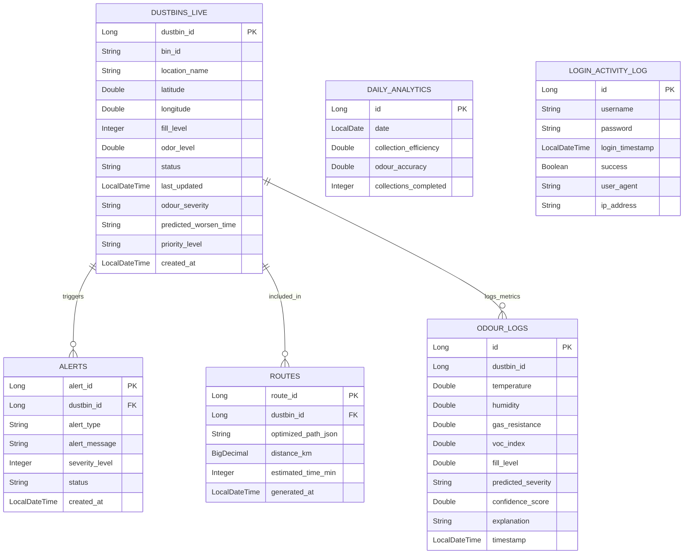

```mermaid
erDiagram
    DUSTBINS_LIVE {
        Long dustbin_id PK
        String bin_id
        String location_name
        Double latitude
        Double longitude
        Integer fill_level
        Double odor_level
        String status
        LocalDateTime last_updated
        String odour_severity
        String predicted_worsen_time
        String priority_level
        LocalDateTime created_at
    }

    ALERTS {
        Long alert_id PK
        Long dustbin_id FK
        String alert_type
        String alert_message
        Integer severity_level
        String status
        LocalDateTime created_at
    }

    ROUTES {
        Long route_id PK
        Long dustbin_id FK
        String optimized_path_json
        BigDecimal distance_km
        Integer estimated_time_min
        LocalDateTime generated_at
    }

    ODOUR_LOGS {
        Long id PK
        Long dustbin_id
        Double temperature
        Double humidity
        Double gas_resistance
        Double voc_index
        Double fill_level
        String predicted_severity
        Double confidence_score
        String explanation
        LocalDateTime timestamp
    }

    DAILY_ANALYTICS {
        Long id PK
        LocalDate date
        Double collection_efficiency
        Double odour_accuracy
        Integer collections_completed
    }

    LOGIN_ACTIVITY_LOG {
        Long id PK
        String username
        String password
        LocalDateTime login_timestamp
        Boolean success
        String user_agent
        String ip_address
    }

    DUSTBINS_LIVE ||--o{ ALERTS : "triggers"
    DUSTBINS_LIVE ||--o{ ROUTES : "included_in"
    DUSTBINS_LIVE ||--o{ ODOUR_LOGS : "logs_metrics"
```
